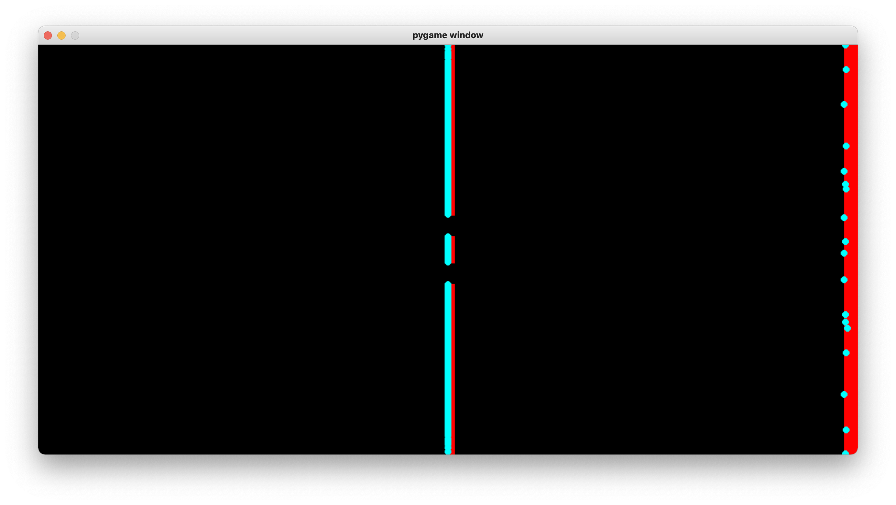

<h1>Electron Double Slit Experiment</h1>

 

<h2>Theory</h2>

The Electron Double Slit Experiment proved the duality of matter: fundamental particles have particle-like properties, as well as wave-like properties.

In the experiment, when electrons were shot through an apparatus with 2 slits, it caused an interference pattern, suggesting that electrons behave like waves, with properties like position and momentum represented by a probability wave.

 
<a href="https://en.wikipedia.org/wiki/Double-slit_experiment">Double Slit Experiment - Wikipedia</a>

 

<h2>Simulation</h2>

This simulation contains abstractions and an implementation of the double slit experiment in which electrons behave like particles only. It goes to show that duality is needed to observe a diffraction pattern.

